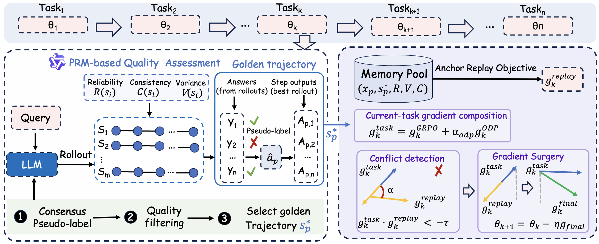
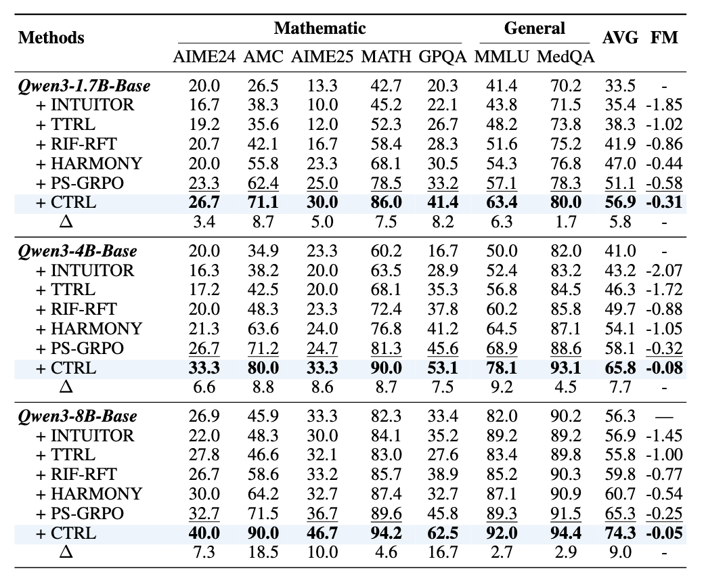

# CTRL: Continual Test-Time Reinforcement Learning for Large Language Models

This repository contains the implementation of **CTRL**, a continual test-time reinforcement learning framework for adapting large language models over a stream of unlabeled reasoning tasks.

CTRL addresses two coupled failure modes in continual TTRL:

- **Error accumulation**: majority-voted pseudo-labels can reinforce wrong answers, and the bias compounds across sequential updates.
- **Catastrophic forgetting**: gradients from new tasks can overwrite reasoning patterns learned from earlier tasks.

CTRL mitigates these issues with PRM-guided trajectory selection, posterior correction, output-process distillation, cognitive anchor replay, and conflict-aware gradient projection.
<p align="center">
  
</p>


## Repository Structure

```text
.
├── README.md
├── model_merge.sh
├── figs/
│   ├── model_framework.pdf
│   ├── model_framework.png
│   └── main_result.png
└── verl/
    ├── data/                         # JSON task splits and preprocessing script
    ├── examples/ctrl/Qwen3/           # CTRL reproduction script
    ├── examples/ttrl/                 # TTRL baseline scripts
    ├── verl/trainer/config/
    │   └── ppo_trainer_cttrl.yaml     # CTRL configuration
    └── verl/trainer/ppo/
        ├── cttrl_local_prm.py         # Local PRM client
        ├── cttrl_memory.py            # Cognitive replay buffer
        ├── cttrl_prm_client.py        # API PRM client
        └── cttrl_utils.py             # CTRL trajectory selection utilities
```

## Installation

Create an environment with Python and install the package in editable mode:

```bash
cd /path/to/CTRL-online_git/verl
pip install -e .
pip install -r requirements.txt
```

For vLLM/SGLang/Megatron dependencies, use the installation scripts provided under `verl/scripts/` when needed:

```bash
bash scripts/install_ttrl_deps.sh
```

The main experiments assume a multi-GPU machine. In the paper, experiments were run on 8 GPUs.

## Running CTRL

The main example script is:

```bash
bash verl/examples/ctrl/Qwen3/math_cttrl.sh
```

Important variables in the script:

- `TASK`: target task, for example `AMC-TTT`, `AIME-TTT`, or `MATH-TTT`.
- `BACKBONE`: policy backbone name.
- `BACKBONE_PATH`: local Hugging Face checkpoint path.
- `K`: number of rollouts per prompt, set to `32` by default.
- `MAX_RESPONSE_LENGTH`: maximum generation length, set to `3072` tokens by default.
- `EPISODE`: number of online training epochs.

You can override most trainer options from the command line:

```bash
bash verl/examples/ctrl/Qwen3/math_cttrl.sh \
  trainer.n_gpus_per_node=8 \
  trainer.total_epochs=20 \
  cttrl.memory.enable_replay=true
```

## Baselines

TTRL baseline scripts are available under:

```text
verl/examples/ttrl/
```

They use majority-voted pseudo-labels and the TTRL reward function in:

```text
verl/verl/utils/reward_score/ttrl_math/
```

## Main Results

In the paper, CTRL improves continual test-time adaptation across Qwen3 and Llama backbones. After completing the full task stream, CTRL achieves higher average accuracy and lower forgetting than TTRL, INTUITOR, RIF-RFT, HARMONY, and PS-GRPO.

Representative final average accuracies:

<p align="center">
  
</p>

CTRL also reduces forgetting, with forgetting measure values closer to zero across model scales.

## Citation

TODO

## License

This project follows the license terms included in this repository. External datasets, models, and dependencies retain their original licenses.
